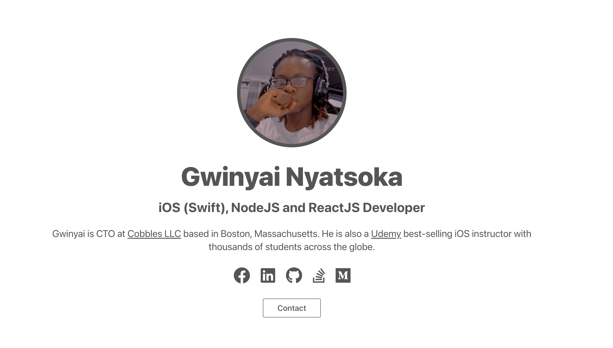

# Gwinyai Web

This is my personal portfolio website. I built this in ReactJS and bootstraped it with Create React App. Visit [https://gwinyai.com] to view the actual website. The HTML and CSS I used is completely vanilla including mobile adaptive features.

## `npm start`

Runs the app in the development mode.\
Open [http://localhost:3000](http://localhost:3000) to view it in the browser.
